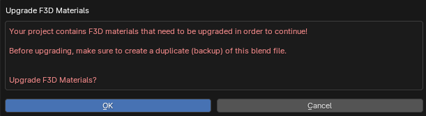
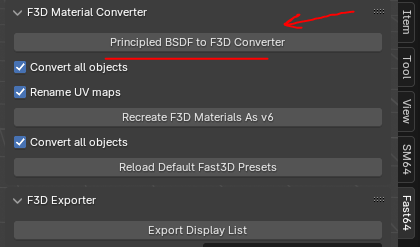
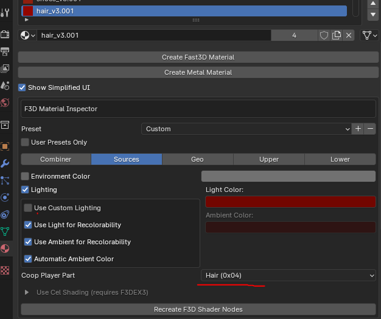
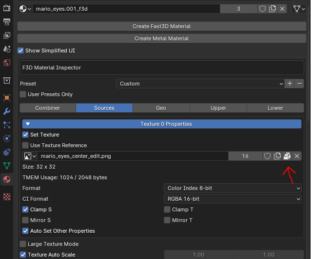
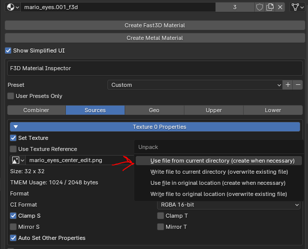

[MACO IMAGE](./bg_maco64DONE.png)

# Super-MA-CO-64
Mod que incluye al grupo de MA-CO a la versión modificada de Super Mario 64 (sm64coopdx). Requiere el mod de Character Selection para poder usar este.

En este repositorio estan los archivos .blend con cada modelo ya exportado y una plantilla base de Mario ya en T-Pose. **En caso de que querais seguir una base, recomiendo que os fijeis en el modelo de Dani o en el de Alejandro.**  

## Requisitos

Para poder hacer o modificar un modelo, vas a necesitar 
- [Blender](https://download.blender.org/release/) (v3.6 - v4.2)
- Plug-in de blender [Fast64](https://github.com/ManIsCat2/Fast64-Gart) (La edición GART, que añade soporte para funcionalidades del modo COOP y es más sencilla de usar e interpretar). 
- [Una plantilla de algun personaje](https://github.com/coop-deluxe/character-template)
- Algun programa de edición de imagenes por si quereis cambiar las texturas del personaje.

## GUIA
Lamentablemente, hay muy pocos videos que te digan explicitamente como portear una skin a esta versión modificada de Super Mario 64, así que voy a poner aquí algunas cosas utiles que hay que
saber antes de empezar a hacer un modelo.

### MODELO

A la hora de hacer el modelo del personaje, tienes dos opciones:

#### MODIFICAR DIRECTAMENTE EL MODELO DE LA PLANTILLA (Más rápido y sencillo).

En caso de que quieras hacer las cosas fácilmente, puedes abrir la plantilla de Mario u otro personaje y una vez pongas al modelo en T-Pose (Mirad el video adjuntado más abajo para entender de que hablo)
puedes empezar a modificar el modelo en si como quieras. De esta manera te ahorras muchos dolores de cabeza con agrupar los modelos y asignar los grupos de vertices.

#### CREAR DE 0 EL MODELO EN SI (Más tedioso y complicado).

Recomiendo que, a no ser que quieras hacer un modelo desde cero y luego quieras importarlo a la plantilla, descargues el propio modelo de [Mario en T-Pose](https://www.models-resource.com/nintendo_64/supermario64/model/1637/) y lo modifiques a tu gusto. Si tienes 
conocimientos mínimos de Blender, es solo cambiar materiales y modificar la posición de los vertices para dar forma a tu modelo. **NO CAMBIES LA ALTURA DEL PERSONAJE**,
ya que si luego quieres usar la plantilla de Mario tendrás que posicionar tu personaje en la misma posición para que los huesos tengan una posicion similar a la del propio Mario (Con otros personajes igual).

### GUIA (VIDEO)

Por suerte, hay un video que resume en unos 8 minutos todo lo necesario para crear una skin con el esqueleto de Mario (Hay un monton de [plantillas](https://github.com/coop-deluxe/character-template) con diferentes esqueletos como Luigi, Wario, etc.). Las principales diferencias en 
esqueletos es la altura del personaje y puede que algunas animaciones. Si tienes pensando hacer un personaje alto, a lo mejor te interesa más utilizar la plantilla de Luigi que la de Mario, y viceversa.

**IMPORTANTE**: El video te enseña a crear un modelo por tu cuenta con el esqueleto de Mario y exportarlo. NO enseña ni como portearlo ni hacerlo con otros personajes, (Recomiendo que en algunos casos mires mira el README de las plantillas de personajes).

https://youtu.be/D-ZQsYedBt8

### DATOS ÚTILES

A lo largo de la creación del modelo, os podeis topar con una serie de cosas que no explica el video (ya que el no lo hace pensando en portearlo a la build coop que vamos a usar nosotros) pero son esenciales para prevenir bugs visuales:

#### MATERIALES 

Cuando hayais instalado Fast-64 y lo hayais activado en la lista de Plug-ins de Blender, vereis que al abrir un archivo puede que os salte el mensaje siguiente: 

En caso de que no salga o le deis a cancelar porque no os gusta leer, podeis hacerlo siempre que querais desde el menu de Fast-64 de Blender.

Si no funciona, a muy malas, siempre podeis cerrar y volver a abrir el archivo para que os vuelva a salir el mensaje.

#### PALETA DE COLORES

Si os fijais, cuando seleccionais un material de el modelo, vereis que hay una parte que dice *"Coop player part"*. Esto es porque sm64coopdx permite añadir diferentes plantillas de colores para los personajes.  
Si no seleccionais la parte correctamente, una vez abrais el juego los materiales se pueden superponer o reemplazar algunos otros.

Ej: Si usais el material del pelo en la camiseta y luego también asignais ese material al pecho, por mucho que modifiqueis algunos vectores del pecho y le pongais otro material en el juego se superpondrá el material del pelo.  

Para evitar esto, podeis asignar la opcion de *"coop player part"* a "None" o ir creando nuevos materiales e ir asignando a que parte del cuerpo del modelo corresponden.  

Recomiendo que a no ser que querais poder recolorear in-game al modelo, pongais todo a None.

#### TEXTURAS

Recomiendo encarecidamente que, si vais a cambiar las texturas, lo hagais creando una copia de la textura original (siguiendo el metodo que hay en las capturas, se os creara una carpeta en el mismo directorio del archivo de blender con el nombre de "textures") 
y modificandola en un editor de imagenes. Si cambias la resolución se os verá raro y os vereis forzados a retocar ciertos vectores del modelo para que se vea bien y es bastante tedioso y frustrante. Tampoco hagais texturas superiores a 4MB, ya que no os dejara exportarlo.

#### AÑADIR OBJETOS AL PERSONAJE.

Si os fijais en los modelos de Miguel, Noah o Izan, vereis que tienen accesorios. Estos acccesorios se añaden igual que se hace en el video con el tema de asignar los grupos de vertices de tu modelo a los de la plantilla.

Elegid bien la parte a la que asignais el accesorio. Izan por ejemplo tiene unos cascos y los asigne a la cabeza, ya que de esta manera cuando se haga algun movimiento con esta los cascos rotaran con la cabeza.  

Si yo los hubiese asignado a el pecho pasaria que los cascos seguirian el movimiento del pecho y cuando la cabeza se moviese, haria overlapping a los cascos.  

#### EXTRAS

Puede que os topeis con errores que ni siquiera yo me he topado y no sepa ni explicarlos. He puesto estos dos porque desde mi ignoracia fueron los que más tiempo me tomó resolver y dar con el problema.  

Hay mucha más info en los repositorios de las plantillas y el de Fast64-Gart, y ahí explican como las cosas deben de hacerse bien, pero con lo que hay aquí y con el video podeis tirar igual de bien que yo.

## TO-DO?
 - Hacer pestañear skin alejandro, noah, izan y arnau (básicamente hacer que se setee el material de la cara 1, 2 y 3 de blender)
 - Hacer foto grupal en M64